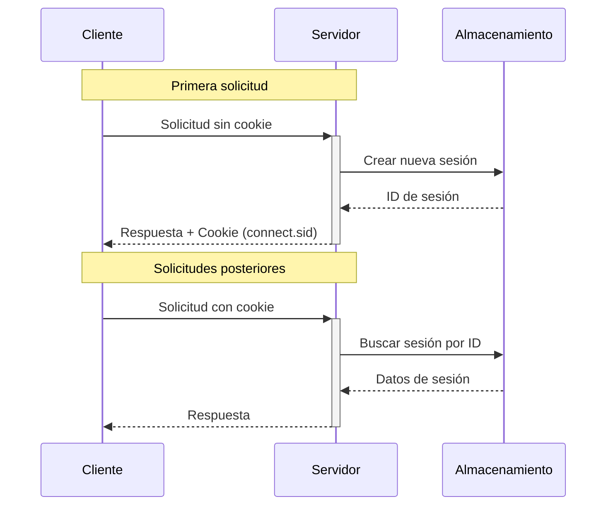

La configuración de Express Session es un sistema que permite mantener información del usuario entre diferentes solicitudes HTTP en una aplicación web. Veamos cómo funciona y sus componentes principales.

### Flujo Básico de Sesiones



En el diagrama anterior podemos observar dos escenarios principales:

1. **Primera solicitud**:
   - El cliente hace una solicitud sin cookie de sesión
   - El servidor crea una nueva sesión en el almacenamiento
   - Se genera un ID único para la sesión (almacenado en la cookie `connect.sid`)
   - El servidor envía tanto la respuesta como la cookie al cliente


2. **Solicitudes posteriores**:
   - El cliente incluye la cookie con el ID de sesión
   - El servidor recupera los datos de la sesión usando ese ID
   - La comunicación es más eficiente ya que los datos están disponibles


### Configuración Principal

Veamos cómo configurar Express Session con sus opciones principales:

```javascript
app.use(session({
  secret: 'tu-clave-secreta',  // Requiere una clave secreta para firmar las cookies
  resave: false,               // No guardar la sesión si no ha habido cambios
  saveUninitialized: false,    // No guardar sesiones nuevas sin modificar
  cookie: {
    maxAge: 3600000,          // Tiempo máximo de la cookie (1 hora en ms)
    httpOnly: true,           // Evita acceso desde JavaScript del cliente
    secure: false             // Usar HTTPS cuando esté disponible
  }
}))
```

### Componentes Principales

1. **secret**:
   - Clave necesaria para firmar las cookies de sesión
   - Debe ser única y segura
   - Puede ser una cadena o un Buffer
   - Recomendado usar variables de entorno para almacenarla


2. **resave y saveUninitialized**:
      
   - `resave: false` evita guardar la sesión si no hubo cambios
   - `saveUninitialized: false` previene el almacenamiento de sesiones nuevas sin modificaciones
   - Estas configuraciones optimizan el uso del almacenamiento


3. **cookie**:
   - `maxAge`: Define cuánto tiempo vive la cookie en milisegundos
   - `httpOnly`: Protege contra ataques XSS al impedir el acceso desde JavaScript
   - `secure`: Asegura que las cookies solo se envíen por HTTPS


### Almacenamiento de Sesiones

Express Session incluye un almacenamiento predeterminado llamado MemoryStore, pero este tiene limitaciones importantes:

- No es adecuado para producción
- Puede causar fugas de memoria
- No funciona con múltiples servidores

Para entornos de producción, se recomienda usar alternativas como Redis o MongoDB para almacenar las sesiones.

### Uso Práctico

```javascript
app.get('/', function(req, res) {
  if (req.session.views) {
    req.session.views++
    res.send(`Has visitado esta página ${req.session.views} veces`)
  } else {
    req.session.views = 1
    res.send('Bienvenido por primera vez')
  }
})
```

### Consideraciones de Seguridad

1. **Clave secreta**:
   - Usa una clave lo suficientemente compleja
   - Mantén la clave fuera del código fuente
   - Considera rotar periódicamente la clave secreta


2. **Cookies seguras**:
   - Activa `secure: true` en producción para usar HTTPS
   - Mantén `httpOnly: true` para proteger contra XSS
   - Configura adecuadamente `sameSite` según tus necesidades


Esta configuración proporciona una base sólida para manejar sesiones de manera segura y eficiente en tu aplicación Express.